Muhammad Afrasyab — Developer Profile
> A premium, animated GitHub profile presentation built with self-contained SVG and Markdown.
✦ Profile
Muhammad Afrasyab  
Web Developer · Software / Digital Solutions
I build modern digital products and websites across development, design, optimization, and automation.
4+ years of WordPress development experience
Custom web development
Mobile and desktop application development
Shopify development
SEO and website optimization
UI/UX and social media design
AI video and digital content workflows
---
⚡ Services
Service	Focus
WordPress	WordPress, Elementor, custom websites
Custom Web Development	Modern responsive web applications
Mobile Apps	Flutter-based mobile applications
Desktop Applications	Desktop software solutions
Shopify	Shopify stores and customization
SEO	Search visibility and on-site optimization
UI / UX	Interface design and user experience
Social Media Design	Digital creatives and campaign assets
AI Video	AI-assisted video and content production
Amazon Setup	Profile and marketplace setup
Maintenance	Website maintenance and updates
Optimization	Performance, speed and technical improvements
---
🧩 Tech Stack
`HTML/CSS` · `JavaScript` · `PHP` · `WordPress` · `Elementor` · `React` · `Angular` · `Flutter` · `Laravel` · `Docker` · `Git` · `GitHub`
Development
HTML5 / CSS3
JavaScript
PHP
WordPress
Elementor / Elementor Pro
React
Angular
Laravel
Flutter
Tools & Workflow
Git / GitHub
Docker
Canva
Adobe Photoshop
Adobe Illustrator
Responsive design
Website optimization
---
🚀 Selected Work
Alfalah Scholarship
Education-focused digital platform and website work.
Carescan
Healthcare-oriented digital platform and marketing/design work.
AlvenzoTech
Digital agency and technology services brand.
Buraq City Kharian
Real-estate digital presence and marketing work.
---
🎨 Profile Variants
This repository includes two visual profile variants:
Dark
`dark.svg`
A dark terminal-inspired interface with a developer-console aesthetic.
Light
`light.svg`
A clean light-mode version using the same information architecture with a softer professional visual system.
---
📁 Files
```text
.
├── dark.svg
├── light.svg
└── README.md
```
---
🖥️ GitHub Usage
You can use the SVG files as visual profile assets in your GitHub profile repository.
For example:
```html
<p align="center">
  
</p>
```
For the light version:
```html
<p align="center">
  
</p>
```
You can also embed the SVG through Markdown:
```md

```
---
🔧 Customization
The SVG files are intentionally self-contained.
You can edit:
Name
Role
Services
Tech stack
Projects
Accent colors
Background
Animation speed
Typography
Terminal labels
GitHub profile links
No external CSS, JavaScript, image library, or web dependency is required by the SVG files.
---
📌 Note About the Portrait
The visual panel currently uses an ASCII-style developer portrait treatment rather than claiming to be an exact photographic likeness.
For an actual personalized portrait, replace the visual/ASCII section with a portrait generated from the user's own supplied photograph.
---
Built With
SVG · Markdown · SMIL Animation · GitHub
---
Muhammad Afrasyab
Build. Ship. Improve.
